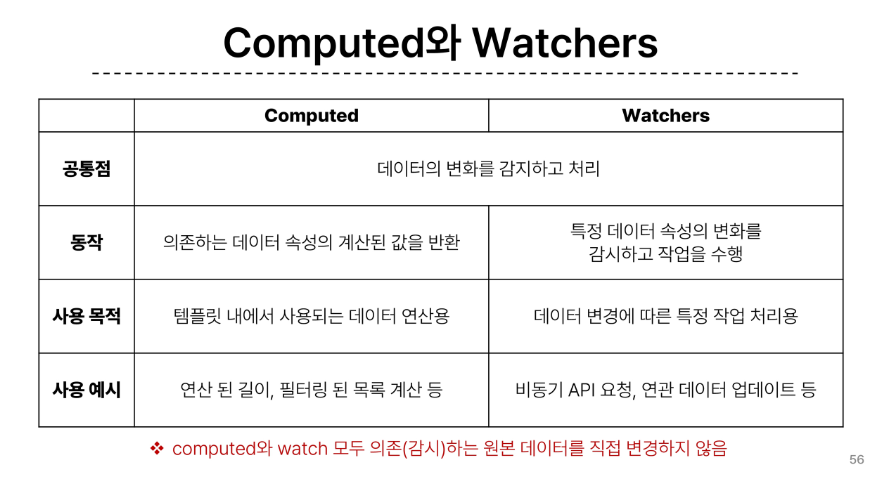

## Basic Syntax 2

- computed(): 계산된 속성을 정의하는 함수. 미리 계산된 속성을 사용하여 템플릿에서 표현식을 단순하게 하고 불필요한 반복 연산을 줄임. 반응성 데이터를 포함하는 복잡한 로직은 computed를 활용하여 미리 값을 계산
  - computed의 특징
    - 반환되는 값은 computed ref이며, 일반 ref와 유사하게 계산된 결과를 .value로 참조할 수 있음
    - computed 속성은 의존된 반응형 데이터를 자동으로 추적
    - 의존하는 데이터가 변경될 때만 재평가
  - computed와 method의 차이
    - computed 속성은 의존된 반응형 데이터를 기반으로 캐시된다!
    - 즉, 의존된 반응형 데이터가 변경되지 않는 한 이미 계산된 결과에 대해 이전 값을 반환
    - 하지만, method 호출은 다시 렌더링이 발생할 때마다 항상 함수를 실행
    - 캐시(Cache): 데이터나 결과를 일시적으로 저장해두는 임시 저장소. 이후에 같은 데이터나 결과를 다시 계산하지 않고 빠르게 접근할 수 있도록 함
      - 페이지 일부 데이터를 브라우저 캐시에 저장 후 같은 페이지에 다시 요청 시 모든 데이터를 다시 응답 받지 않고, 캐시된 데이터를 사용하여 더 빠르게 웹 페이지 렌더링
    - computed와 method의 적절한 사용처
      - computed: 의존하는 데이터에 따라 결과가 바뀌는 계산된 속성을 만들 때 유용. 중복 계산 방지. => 의존된 데이터가 변경되면 자동 업데이트
      - method: 단순히 특정 동작을 수행하는 함수를 정의할 때 사용. 데이터 의존 여부와 관계 없이 항상 동일한 결과를 반환하는 함수. => 호출해야만 실행
- Conditional Rendering
  - v-if: 표현식 값의 T/F를 기반으로 요소를 조건부 렌더링
    - 'v-else', 'v-else-if' directive를 사용하여 블록을 나타낼 수 있음
  - v-show: 표현식 값의 T/F를 기반으로 요소의 가시성을 전환(렌더링과는 다름). 렌더링은 되지만, style에서 display='none'으로 설정되어서 보여지지는 않음
  - v-if vs v-show
    - v-if: 초기 조건이 false인 경우 아무 작업도 수행하지 않음. 토글 비용이 높음. 지우고 새로 렌더링하기 때문에
    - v-show: 초기 조건에 관계 없이 항상 렌더링. 토글이 되었을 때는 style만 바꾸기 때문에 토글 비용이 낮다.
    - 무언가를 자주 전환해야 하는 경우에는 v-show를, 실행 중에 조건이 변경되지 않는 경우에는 v-if를 권장
- List Rendering
  - v-for: 소스 데이터를 기반으로 요소 또는 템플릿 블록을 여러 번 렌더링
    - 구조: alias in expression 형식의 특수 구문을 사용하여 반복되는 현재 요소에 대한 별칭을 제공. 파이썬과 유사함
    - 여러 요소에 대한 v-for 적용: template 요소에 v-for를 사용하여 하나 이상의 요소에 대해 반복 렌더링 할 수 있음
    - 중첩 v-for: 각 v-for 범위는 상위 범위에 접근할 수 있음
    - 반드시 v-for와 key를 함께 사용
    - v-for와 v-if는 동시에 사용할 수 없음. v-if가 우선순위가 더 높아서 v-for랑 동시 사용 불가
      - 해결방법
        - 1) computed를 활용해 필터링 된 목록을 반환하여 반복하도록 설정. 
        - 2) v-for와 template 요소를 사용하여 v-if를 이동. 이렇게 되면 template에서 v-for 먼저 실행하기 때문에 우선순위의 역전이 일어나지 않음.
- Watchers
  - watch(): 반응형 데이터를 감시하고, 감시하는 데이터가 변경되면 콜백 함수를 호출
    - 구조
      - variable: 감시하는 변수
      - newValue: 감시하는 변수가 변화된 값, 콜백 함수의 첫번째 인자
      - oldValue: 콜백 함수의 두번째 인자
  - Computed와 Watchers 비교 
  

- Lifecycle Hooks
  - Vue 인스턴스의 생애주기 동안 특정 시점에 실행되는 함수 => 개발자가 특정 단계에서 의도하는 로직이 실행될 수 있도록 함
  - onMounted : 렌더링 되었을 때 실행
  - onUpdated : 반응형 데이터의 변경으로 컴포넌트의 DOM이 업데이트된 후 특정 로직 수행
  - Lifecycle Hooks의 특징
    - Vue는 Lifecycle Hooks에 등록된 콜백 함수들을 인스턴스와 자동으로 연결함
    - hooks 함수들은 반드시 동기적으로 작성되어여야 함
    - 인스턴스 생애 주기의 여러 단계에서 호출되는 다른 hooks도 있으며, 가장 일반적으로 사용되는 것은 onMounted, onUpdated, onUnmounted
- Vue Style Guide
  - Vue의 스타일 가이드 규칙은 우선순위에 따라 4가지 범주로 나눔
  - 규칙 범주
    - 우선순위 A: 필수(오류를 방지하는 데 도움이 되므로 어떤 경우에도 준수)
      - v-for를 사용할 때 key 넣기
      - v-if와 v-for를 같이 사용하지 않기
    - 우선순위 B: 적극 권장(가독성 및 개발자 경험 향상. 규칙 어겨도 실행은 되지만, 정당한 사유가 있어야 함)
    - 우선순위 C: 권장(일관성을 보장하도록 임의 선택을 할 수 있음)
    - 우선순위 D: 주의필요(잠재적 위험 특성을 고려함)
- 참고
  - computed 사용 시
    - 반환 값은 변경 X
    - 원본 배열 변경 X
    - 배열의 인덱스를 v-for의 key로 사용 X
    - 배열 교체(원본 배열을 수정하지 않고 새 배열을 반환) : filter(), concat(), slice()

